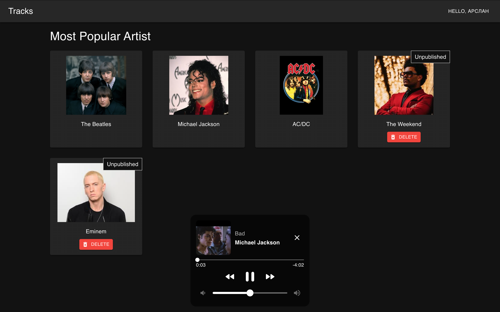
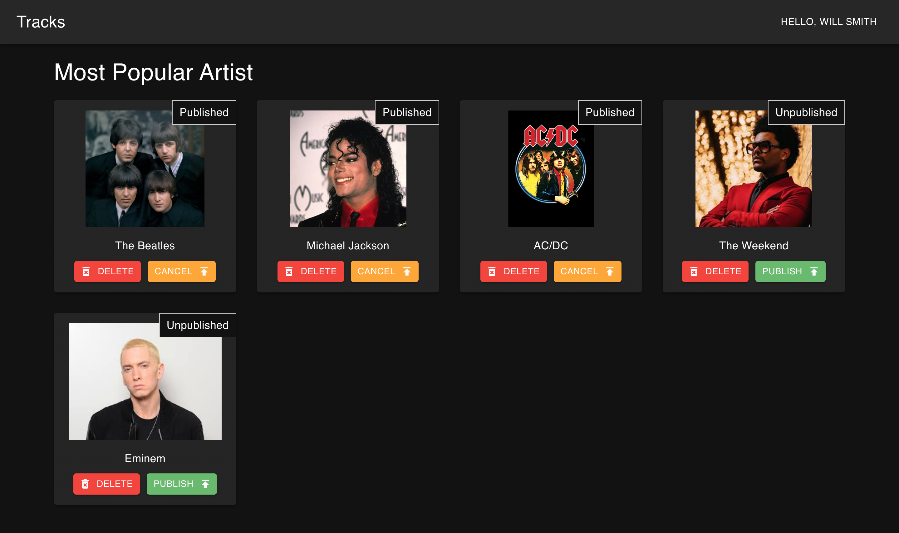
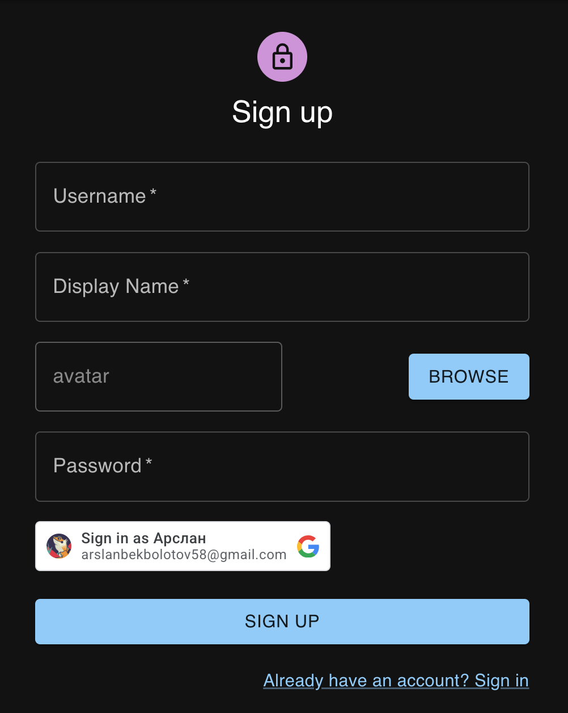

# 🎵 Harmony Music App — Fullstack Music Platform

## 📝 Описание
Современное веб-приложение для прослушивания музыки и просмотра видеоклипов. Проект включает в себя гибкую систему управления контентом, глобальный плеер и интеграцию с внешними сервисами. Пользователи могут делиться своими историями прослушивания, которые проходят модерацию перед публикацией.

### [🎯 Смотреть демо](https://music-app-five-flame.vercel.app/)

---

---

## ✨ Основные функции

* **Авторизация:** Вход через классическую почту или аккаунт **Google (OAuth)**.
* **Глобальный плеер:** Музыкальный плеер закреплен в приложении и не прерывается при переходе между страницами.
    * Управление громкостью и прогрессом.
    * Переключение треков внутри альбомов.
* **Контент:** Возможность добавлять артистов, альбомы и отдельные песни.
* **YouTube Video:** Встроенный функционал для просмотра видео через YouTube.
* **Система модерации:** Пользовательские публикации (истории) попадают в общий доступ только после подтверждения администратором.
* **Админ-панель:** Полные права на редактирование и удаление любого контента на платформе.

---

## 🛠 Технологии

### Frontend
- **React + TypeScript** — интерфейс и типизация.
- **Material-UI (MUI)** — компоненты и стилизация.
- **Redux Toolkit & Persist** — управление глобальным состоянием и сохранение данных в `localStorage`.
- **Axios** — взаимодействие с API.
- **React Router** — навигация.

### Backend
- **Express** — серверная часть на Node.js.
- **MongoDB Atlas** — облачная база данных.
- **Cloudinary** — хранилище для обложек и медиа-файлов.

---

## 🔑 Доступ администратора

Для тестирования функций модерации и полного управления контентом используйте:
* **Логин:** `admin`
* **Пароль:** `123`

---

## 🔧 Команды запуска

### Frontend
Сначала перейдите в директорию клиента и установите зависимости через `npm install`.

* `npm start` — запуск сервера разработки.
* `npm run build` — создание оптимизированной сборки.
* `npm run lint` — проверка кода линтером.
* `npm run format-all` — форматирование через Prettier.

### Backend
Перейдите в директорию сервера и установите зависимости через `npm install`.

* `npm run dev` — запуск сервера в режиме разработки (nodemon).
* `npm run seed` — заполнение базы данных тестовыми данными.
* `npm run format-all` — быстрое форматирование всего серверного кода.

---

## Стек технологий

---